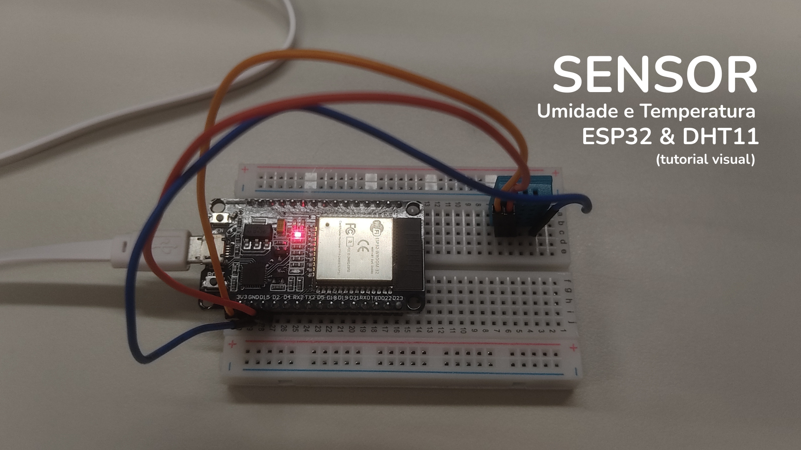
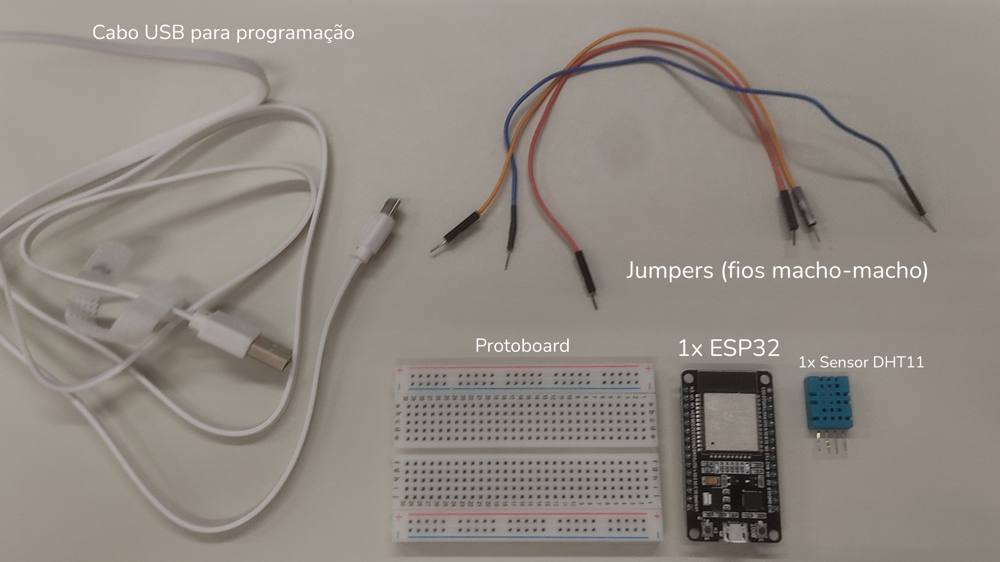
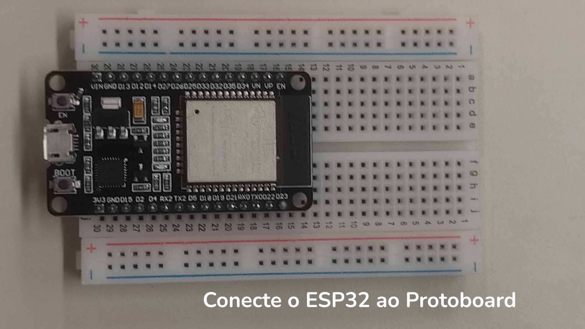
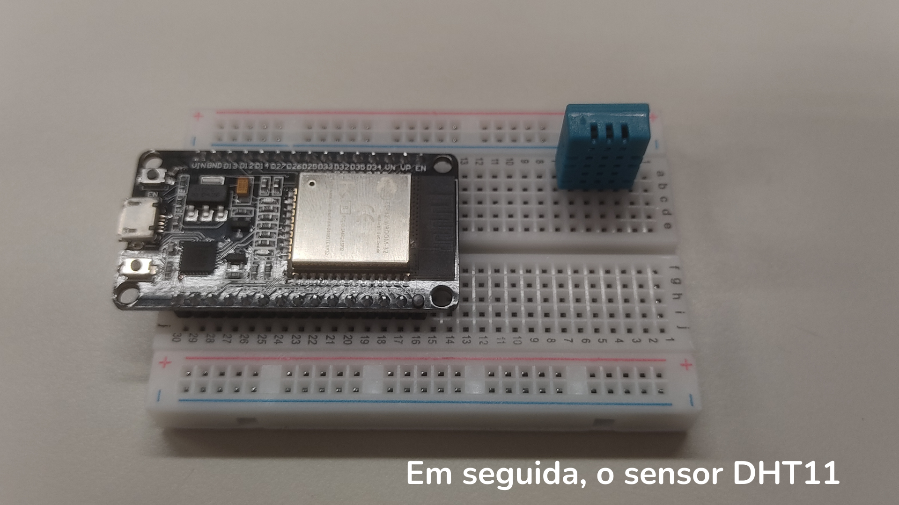
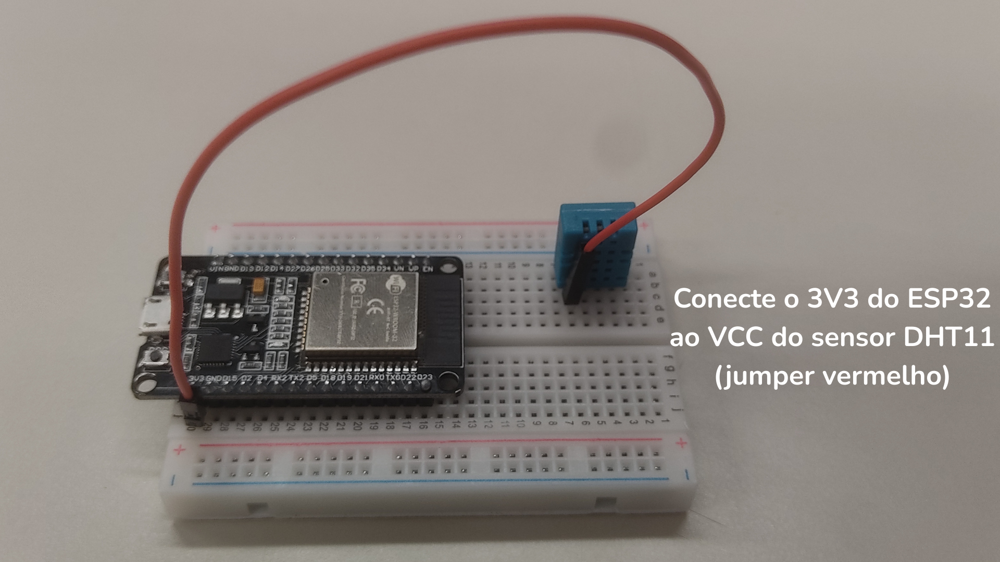
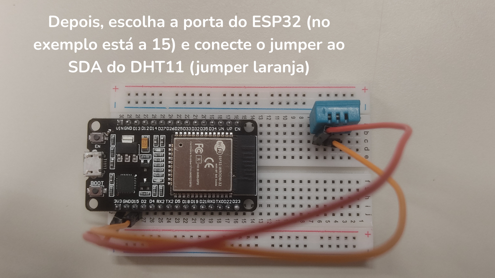
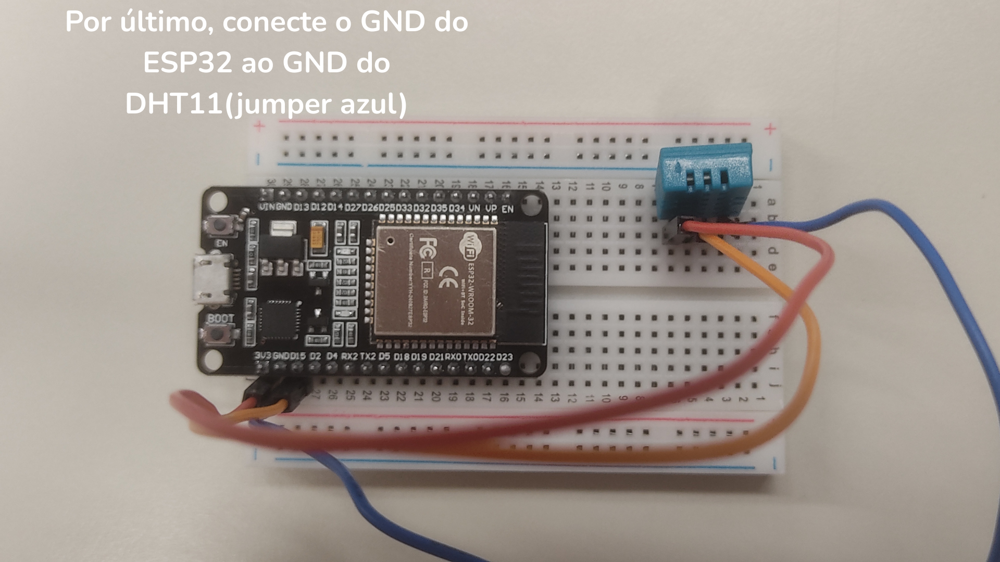
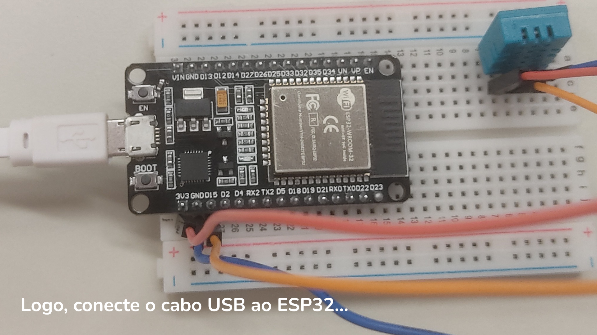
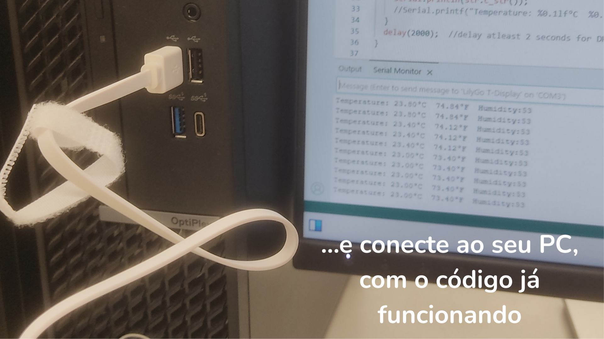
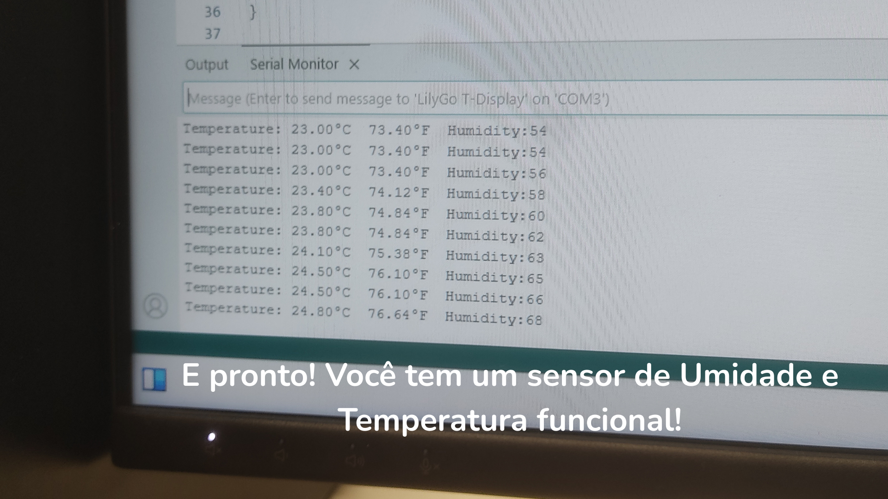

# 🌡️ Sensor-de-Umidade-e-Temperatura-TUTORIAL-
Um tutorial detalhado de como montar e programar um sensor de umidade e temperatura utilizando o ESP32 e DHT11.

## 📌 Materiais Necessários
- 1x **ESP32-WROOM32**
- 1x **Sensor DHT11**
- Jumpers (fios de conexão)
- Protoboard
- Cabo USB para conectar o ESP32 ao computador

---

## 🔌 Ligações do Circuito
Conecte o **DHT11** ao **ESP32** conforme abaixo:

| Pino DHT11 | Pino ESP32 |
|------------|------------|
| VCC        | 3.3V       |
| GND        | GND        |
| DATA       | GPIO 15    |

> ⚠️ No código, o pino configurado é o **15**. Se usar outro, altere a linha `Bonezegei_DHT11 dht(15);`.

---
## 💻 Código para ESP32
Copie e cole esse código no seu Arduino IDE.
    
    /*
      Read Temperature and Humidity
      DHT11 Library
      Author: Bonezegei (Jofel Batutay)
      Date : November 2023
    
      Tested using ESP32-WROOM32
    */
    
    #include <Bonezegei_DHT11.h>
    
    // Param = DHT11 signal pin
    Bonezegei_DHT11 dht(15);
    
    void setup() {
      Serial.begin(115200);
      dht.begin();
    }
    
    void loop() {
      if (dht.getData()) {                         // Lê dados do DHT11
        float tempDeg = dht.getTemperature();      // Temperatura em Celsius
        float tempFar = dht.getTemperature(true);  // Temperatura em Fahrenheit
        int hum = dht.getHumidity();               // Umidade relativa do ar (%)
        
     String str  = "Temperature: ";
               str += tempDeg;
               str += "°C  ";
               str += tempFar;
               str += "°F  Humidity:";
               str += hum;
        Serial.println(str.c_str());
    
        // Exemplo alternativo de saída formatada:
        // Serial.printf("Temperature: %0.1lf°C  %0.1lf°F  Humidity: %d%%\n", tempDeg, tempFar, hum);
      }
      delay(2000);  // Aguardar 2 segundos entre leituras
    } 

## ▶️ Passo a Passo

### 1️⃣ Montagem do Circuito
- Coloque o **ESP32** e o **DHT11** na protoboard.
- Conecte os pinos conforme a **tabela de ligações**.
- Certifique-se de que o pino **DATA** do DHT11 está ligado ao **GPIO 15** do ESP32.

### 2️⃣ Configuração da IDE Arduino
1. Abra o **Arduino IDE**.
2. Vá em **Ferramentas → Placa → Gerenciador de Placas** e instale **ESP32 by Espressif Systems**.
3. Instale a biblioteca **Bonezegei_DHT11**:
- **Sketch → Incluir Biblioteca → Gerenciar Bibliotecas**
- Procure por **Bonezegei_DHT11** e instale.

### 3️⃣ Upload do Código
1. Copie o **código fornecido acima** e cole no **Arduino IDE**.
2. Em **Ferramentas → Placa**, selecione **ESP32 Dev Module**.
3. Em **Ferramentas → Porta**, escolha a **porta USB** correta.
4. Clique no botão **Upload** (seta para direita) para carregar o programa no ESP32.

### 4️⃣ Monitoramento dos Dados
1. Após o upload, abra o **Monitor Serial** (**Ctrl + Shift + M**).
2. Configure a taxa de transmissão em **115200 baud**.
3. Observe as leituras sendo exibidas a cada **2 segundos**.

### Tutorial Visual(Montagem)

